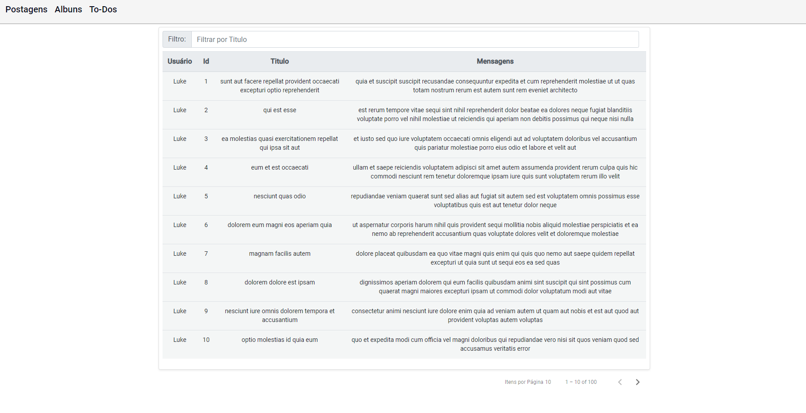

# Framework Teste

Este projeto foi criado em Angular [Angular CLI](https://github.com/angular/angular-cli) version 12.1.1. , visto que decidi principalmente me desafiar a criar uma UI em uma angular que só realizei alguns exercicios com ela.

Para iniciar o projeto, seguir os passos abaixo:
## Servidor de Desenvolvimento

Rode `ng serve` em um servidor de desenvolvimento. Navegue até `http://localhost:4200/`. o App irá recarregar automaticamente se você fizer qualquer alteração no código fonte.

## Scaffolding

Rode `ng generate component component-name` para gerar um novo component. Você pode também usar `ng generate directive|pipe|service|class|guard|interface|enum|module`.

## Build

Rode `ng build` para 'buildar' o projeto.  Os artefatos contruidos serão armazenados no diretorio `dist/` .

API Publica utilizada neste projeto: [{JSON} Placeholder](https://jsonplaceholder.typicode.com)

Tela de Exemplo:

